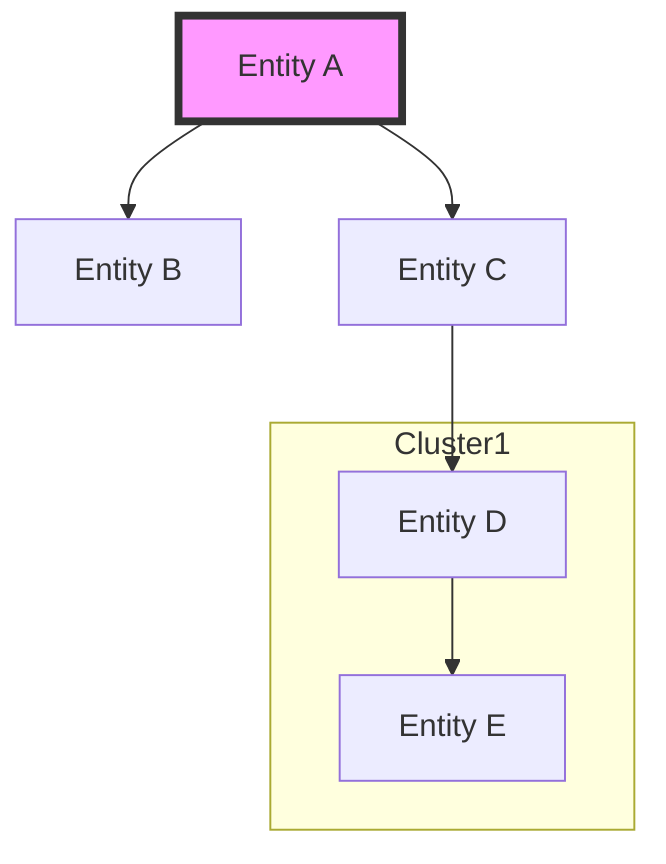
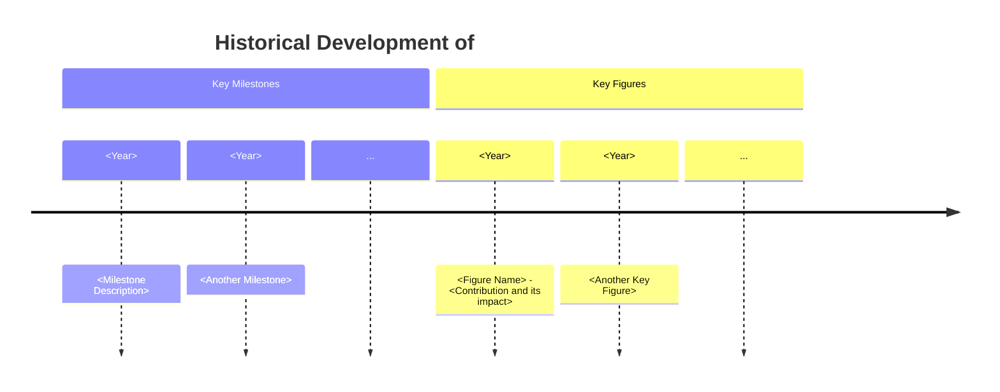

# `AutoKB`

A [LangGraph](https://langchain-ai.github.io/langgraph/)-powered, highly optimized, and robustly configurable multi-agent LLM system for personal knowledge base generation.

## Backend

```
autokb/
|-- __init__.py
|-- agent.py
|-- api.py
|-- cli.py
|-- utils/
|   |-- __init__.py
|   |-- autokb_logging.py
|   |-- generate_kb.py
|   |-- nodes.py
|   |-- schema.py
|   |-- sqlite_db.py
|   |-- state.py
|   |-- tools.py
```

Multi-agent LLM system for personal knowledge base generation.

Agents:
- Planning
  - Planner/Manager: Plans out necessary tasks to generate a personal knowledge base
- Research
  - Research Planner/Manager: Manages the research process and synthesizes findings into final overall research notes
  - Researchers: Collects information from the web and synthesizes findings into highly robust, comprehensive, informative, and succinct research summaries
    - [Tavily](https://tavily.com/)
    - [Serper](https://serper.dev/)
    - [Reddit](https://www.reddit.com/)
    - [Wikipedia](https://www.wikipedia.org/)
    - [Wikidata](https://www.wikidata.org/)
    - [Arxiv](https://arxiv.org/)
    - [Semantic Scholar](https://www.semanticscholar.org/)
- Writers
  - Description: Expanded to cover not just fundamental concepts but also challenges and future perspectives, making it comprehensive and engaging.
    - Around 1000 words
  - Knowledge Graph: Emphasized the use of advanced features like subgraphs and styled nodes to make the graph both visually appealing and informative.
    - maximally broad and deep; hyper-fine granularity. Topic / Concept map
  - Core Concepts & Applications: Each core associated concept and application is robustly defined, with an emphasis on clarity, interrelation, and practical implications.
  - Resources & Tools: Entries are curated with clear justification for their inclusion, ensuring relevance and value.
  - Research & Open Questions: Focused on keeping content current and forward-looking, with clear connections to broader context and future research opportunities.
  - Historical Context & Key Figures: Timeline syntax is used to create a visually engaging historical overview, with clear, informative entries for milestones and key figures.
  - Ethical Considerations: Expanded to encourage reflection on broader societal impacts and responsible research/application.
  - Future Directions: Includes data-driven predictions and expert opinions to guide readers toward emerging opportunities and challenges.
  - Related Topics: Optimized for navigation and thematic connectivity, enhancing the overall usability of the knowledge base.

### Knowledge Base Page Template

``````md
---
title: "<Topic>"  # Title of the topic page
tags: "<Comma-separated tags>"  # Categorize the topic effectively
aliases: "<Comma-separated aliases>"  # Alternative names or terms
cssclasses: "<CSS classes>"  # Custom styling options
created: "<YYYY-MM-DDTHH:MM>"  # ISO 8601 format for creation date
updated: "<YYYY-MM-DDTHH:MM>"  # ISO 8601 format for last update
---

# <Topic>

<-- Description Section -->
<!-- Comprehensive and detailed description tailored for post-doctoral scholars -->
<!-- Aim for 1000 words covering fundamental concepts, significance, -->
<!-- context within the broader field, current understanding, challenges, -->
<!-- and future perspectives. -->

<Provide a 1000-word in-depth overview, blending theoretical insights with practical relevance.>

<-- Knowledge Graph Section -->
<!-- Advanced mermaid.js graph using entity-relation semantic triplets -->
<!-- Capture direct and nuanced connections between entities, concepts, -->
<!-- and subtopics. Use subgraphs, clusters, and styled nodes/edges. -->



---

## Core Concepts

<!-- Foundational overview of key concepts critical to the topic -->
<!-- Ensure clarity and accessibility for complex ideas -->
<!-- Include references to seminal papers or key texts -->

- **Concept 1:** <Detailed explanation, including definition, relevance, principles/theories, and controversies.>
- **Concept 2:** <Explanation with focus on interrelations and practical implications.>
- **Concept 3:** <Continue with additional core concepts, emphasizing their importance.>
- ...
...

<Provide citations where applicable.>

---

## Applications

<!-- Illustrate the real-world significance of the topic -->
<!-- Detailed descriptions of applications, supported by examples, case studies, -->
<!-- and industry use cases. Highlight relevance, impact, successes, and challenges. -->

- **Application 1:** <Detailed description with examples and case studies.>
- **Application 2:** <Highlight innovative uses and implications for future research.>
- **Application 3:** <Continue with additional applications, supported by data and visuals where possible.>
- ...
...

<Offer clear insights into practical implications. Include references to case studies where applicable.>

---

## Resources & Tools

<!-- Curated list of essential resources and tools for further learning -->
<!-- and practical support. Justify relevance and explain value of each entry. -->

- **Resource 1:** <Link and description of a key resource. Explain its importance.>
- **Tool 1:** <Describe a relevant tool with links to documentation/repository. Explain its significance.>
- **Resource 2:** <Continue listing significant resources and tools, ensuring each is relevant.>

<Explain the value of each entry and how it contributes to a deeper understanding or effective application of the topic.>

---

## Research & Open Questions

<!-- Cover recent developments in the field and major unanswered questions -->
<!-- driving ongoing research. Keep the section current and forward-looking. -->

- **Recent Research:** <Summarize or link to recent research articles, highlighting significant findings.>
- **Open Question 1:** <Identify and discuss an unresolved question or gap.>
- **Open Question 2:** <Continue with additional questions, encouraging further inquiry.>

<Ensure each entry is clearly linked to the broader context of the topic.>

---

## Historical Context & Key Figures



<!-- Comprehensive historical overview using mermaid.js timeline syntax -->
<!-- Use styling to differentiate between milestones and key figures -->

<Ensure that each milestone and key figure is concisely and clearly described. Style the timeline for visual engagement.>

---

## Ethical Considerations

<!-- Address moral and ethical implications associated with the topic -->
<!-- Provide balanced perspectives and frameworks for responsible navigation. -->

- **Ethical Issue 1:** <Identify and discuss a key ethical issue, including its implications.>
- **Ethical Issue 2:** <Continue with additional ethical issues, ensuring thorough exploration.>

<Ensure a balanced presentation of ethical issues, including both sides of any debate.>

---

## Future Directions

<!-- Speculate on future trends and directions based on current research -->
<!-- and technological advancements. Offer foresight into opportunities and challenges. -->

- **Trend 1:** <Describe a future trend and its potential impact.>
- **Trend 2:** <Continue with additional trends, supported by data or expert opinions.>

<Provide insights into where the field might be headed, backed by current research or expert predictions.>

---

## Related Topics

<!-- Connect the topic to other relevant areas within the knowledge base -->
<!-- Ensure meaningful relationships to enhance usability and interactivity. -->

- [[Related Topic 1]]
- [[Related Topic 2]]
- [[Related Topic 3]]
- ...

<Each related topic should be thoughtfully chosen to reflect significant connections.>
``````

### Tech Stack

- LangGraph
- Typer
- FastAPI
- Loguru + Rich + TQDM
- Pydantic
- Langfuse
- Langsmith
- Langchain
- LLamaIndex / LLamaHub
- JSON
- YAML

### Useful commands
generate kb using cli and config
```zsh
poetry run python autokb/cli.py generate --config-file=config.yaml
```