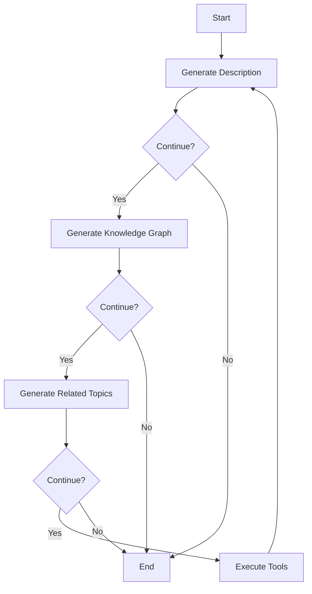

# LangGraph Cloud Example


This is an example agent to deploy with LangGraph Cloud.

> 💡 **Tip:** If you would rather use `requirements.txt` for managing dependencies in your LangGraph Cloud project, please check out [this repository](https://github.com/langchain-ai/langgraph-example).

[LangGraph](https://github.com/langchain-ai/langgraph) is a library for building stateful, multi-actor applications with LLMs. The main use cases for LangGraph are conversational agents, and long-running, multi-step LLM applications or any LLM application that would benefit from built-in support for persistent checkpoints, cycles and human-in-the-loop interactions (ie. LLM and human collaboration).

LangGraph shortens the time-to-market for developers using LangGraph, with a one-liner command to start a production-ready HTTP microservice for your LangGraph applications, with built-in persistence. This lets you focus on the logic of your LangGraph graph, and leave the scaling and API design to us. The API is inspired by the OpenAI assistants API, and is designed to fit in alongside your existing services.

In order to deploy this agent to LangGraph Cloud you will want to first fork this repo. After that, you can follow the instructions [here](https://langchain-ai.github.io/langgraph/cloud/) to deploy to LangGraph Cloud.

## Multi-Agent LLM System for Personal Knowledge Base Generation

This project has been refactored to be a multi-agent LLM system for personal knowledge base generation. The generator uses a YAML config file and iteratively generates knowledge base pages for a list of seed topics. The system includes separate agents for description, knowledge graph, and related topic list generation.

### Features

- **Iterative Generation**: The system supports iterative generation with depth configuration.
- **Separate Agents**: Separate agents for description, knowledge graph, and related topic list generation.
- **Topic Tracking**: Tracks which topics have already been covered and manages a queue of topics to generate.
- **Advanced LangGraph Features**: Utilizes advanced LangGraph features and functionalities, including parallelization and concurrency.
- **Research Tools**: Conducts research using Tavily Search and Serper, with well-managed and cached results to minimize resource usage.
- **Logging and Tracing**: Uses langfuse, langsmith, loguru, rich, and tqdm for tracing and logging.

### Configuration

The system uses a YAML configuration file (`config.yaml`) to define topics, agent settings, tools, and output settings. Below is an example configuration:

```yaml
topics:
  - Knowledge Management
  - Entrepreneurship
  - Decisions
  - Optimization
  - Large Language Models (LLMs)
  - Prompt Engineering
  - Artificial Intelligence (AI)
  - Machine Learning (ML)
  - Data
  - Data Science
  - Data Analytics
  - Data Engineering
  - Mathematics
  - Statistics
  - Computer Science
  - Software Engineering
  - Knowledge Graphs
  - Semantic Web
  - Ontologies

agent:
  model: 'gpt-4o'
  system_prompt: 'You are a knowledge base generator for post-doctoral researchers.'
  description_max_words: 1000 # Configurable max word count for description

tools:
  max_search_results: 5
  cache_ttl: 86400 # TTL in seconds (24 hours)
  max_depth: 2 # Added max_depth to tools config

output:
  working_directory: './kb_output'
```

### Output

The generated knowledge base pages follow the structure below:

```md
# <Topic>

<Description of Topic geared towards audience of post-doctoral technical scholars around 1000 words>

<knowledge graph / domain map / topic map / concept map (entities and relationships / nodes + labelled arcs ) of the topic and related entities using advanced, well-styled mermaid.js markdown (.md) syntax>

---

## Related Topics

- [[Related Topic 1]]
- [[Related Topic 2]]
- ...
```

### Architecture Diagram



### Deployment

To deploy this multi-agent LLM system to LangGraph Cloud, follow the instructions provided in the original README section above.
